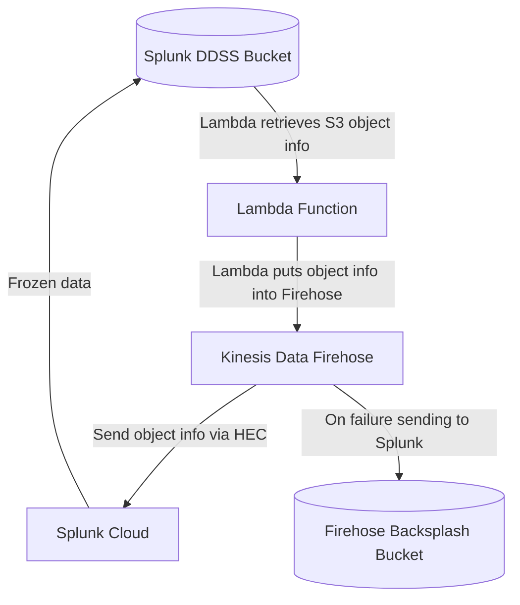

# Splunk DDSS Exploration Toolkit

## Architecture Overview

When Splunk sends data to a DDSS S3 bucket, it copies the raw, compressed indexed data to the S3 bucket.  That data is contained in multiple  `journal.zst` objects (files) in the S3 bucket.  This toolkit will read relevant metadata (object name) from the S3 bucket using a [Lambda function](https://aws.amazon.com/lambda/), construct events in a format Splunk can receive over HEC, then send the object information to Splunk over [HEC](https://docs.splunk.com/Documentation/SplunkCloud/latest/Data/UsetheHTTPEventCollector) via [Kinesis Data Firehose](https://aws.amazon.com/kinesis/data-firehose/).  By default, the Lambda function will retrieve the metadata from the S3 bucket every 6 hours.  The CloudFormation template that's provided can optionally create a new S3 bucket and the relevant S3 bucket permissions, for your Splunk Cloud environment to save DDSS data to, as well as [S3 Lifecycle](https://docs.aws.amazon.com/AmazonS3/latest/userguide/lifecycle-transition-general-considerations.html) rules to send data to another S3 storage tier, such as S3 Glacier.

Visual overview: 

Mermaid code of visual overview:

## Deployment Instructions

These instructions are for deploying the necessary AWS resources for Splunk to receive information about the DDSS objects in an S3 bucket.  The AWS resources are packaged in a CloudFormation template, and these can be deployed via the normal methods for deploying CloudFormation, such as the CloudFormation console or AWS CLI.

1. Configure any firewall rules in front of Splunk to receive data from AWS Kinesis Data Firehose.
	- Reference the [AWS documentation](https://docs.aws.amazon.com/firehose/latest/dev/controlling-access.html#using-iam-splunk-vpc) for the IP ranges required.  Make sure to add the IP ranges from the region you'll be deploying the CloudFormation to.
	- Since you're using Splunk Cloud, you'll want to [add the relevant IP range(s) to the HEC feature in the IP allowlist](https://docs.splunk.com/Documentation/SplunkCloud/8.2.2203/Admin/ConfigureIPAllowList)
2. [Create a HEC token]((https://docs.splunk.com/Documentation/SplunkCloud/latest/Data/UsetheHTTPEventCollector#Create_an_Event_Collector_token_on_Splunk_Cloud_Platform) with [Indexer acknowledgment](https://docs.splunk.com/Documentation/SplunkCloud/Latest/Data/AboutHECIDXAck) turned on, in Splunk to ingest the events, with these specific settings:
	- Make sure to enable indexer acknowledgment.
	- Set the source name override to `aws_cloudwatchevents_guardduty`.
	- Set the sourcetype to `aws:cloudwatch:guardduty`. 
	- Select the index you want the data to be sent to.
	- AWS Kinesis Data Firehose does check the format of the tokens, so we recommend letting Splunk generate this rather than setting it manually through inputs.conf.
3. Deploy the [cloudformation.yml](https://github.com/pdreeves/splunk-ddss-exploration-toolkit/cloudformatio.yml) template to configure the necessary AWS resources.  You'll need to set the following parameters to settings specific to your Splunk Cloud environment:
	- existingS3BucketName or `newS3BucketName`: Specifying an `existingS3BucketName` for the DDSS Toolkit to use, or specify a new bucket name in the `newS3BucketName` parameter field.
	- splunkHECEndpoint:  `https://http-inputs-firehose-{{stackName}}.splunkcloud.com:443`, where `{{stackName}}` is the name of your Splunk Cloud stack.
	- splunkHECToken: The value of the HEC token from step 2
	- splunkIndex: The index DDSS object information will be sent to.
	- splunkPrincipal: Only needed when creating a new bucket for DDSS object.  This is the principal displayed by Splunk Cloud when adding a new DDSS endpoint.
	- stage: If this is going into production, set this to something like `prod`
4. Verify that data is being ingested.  The easiest way to do this is wait at least 6 hours, then run a search of `index={{splunkIndex}} sourcetype=splunk-ddss-exploration-toolkit`.

## FAQ
- **How can I tune the Lambda function?** There are a few different settings on the `lambdaFcuntion` resource in the CloudFormation template:
	- `MemorySize`: How much memory to allocate to the Lambda function.  The amount of allocated memory is directly related to how much processing power is allocated to the Lambda function.  This means that the more memory that is allocated (usually) the faster the Lambda function runs.  Raise this value to lower event latency, and/or if the function is timing out.
	- `Timeout`: How long to let the Lambda function run before terminating it.  Raise this if the Lambda function is timing out.
- **The Lambda function is executing too often, or my expenses are too high.  What can I do?**  Change the `ScheduleExpression` setting on the `eventBridgeSchedule` resource in the CloudFormation template so that the Lambda function executes less frequently.  AWS has documentation on how to format that setting [here](https://docs.aws.amazon.com/AmazonCloudWatch/latest/events/ScheduledEvents.html).
- **I found a typo.  What should I do?**  Feel free to message me on the community Slack or submit a PR.  I'm really bad at typos.  Thank you!
- **I have another question.  What should I do?**   Feel free to message me on the community Slack!  I'd love to help.

## Troubleshooting
- **The Lambda function is timing out.**  See the "How can I tune the lambda function?" question in the FAQ.
- **The CloudFormation template fails to deploy when I try to deploy it.**. 
	- Verify that the role you are using to deploy the CloudFormation template has the appropriate permissions to deploy the resources you're trying to deploy.
	- Verify that the parameters are set correctly on the stack.
	- Also, in the CloudFormation console, check the events on the failed stack for hints to where it failed.
	- Also see the official [Troubleshooting CloudFormation](https://docs.aws.amazon.com/AWSCloudFormation/latest/UserGuide/troubleshooting.html) documentation.
- **Events aren't getting to Splunk.  What should I check?**  In this order, check the following:
	1. That the CloudFormation template deployed without error.
	2. That the parameters (especially splunkHECEndpoint and splunkHECToken) are correct.
	3. That the log files are being put into the S3 bucket.  The easiest way to do this is just to check the bucket through the AWS Console to see if objects (files) are being put (copied) to it.
	4. That SQS messages are being delivered from the S3 bucket to the SQS queue by going to the SQS queue in the AWS Console, clicking the "Monitoring" tab, then looking at the "Number of Messages Received" pane.
	5. That the Lambda function is executing by going to the Lambda function in the AWS Console, clicking the "Monitor" tab, then the "Metrics" sub-tab and looking at the "Invocations" pane.
	6. That the Lambda function is executing successfully by going to the Lambda function in the AWS Console, clicking the "Monitor" tab, then the "Metrics" sub-tab and looking at the "Error count and success rate (%)" pane.
	7. That the Lambda function isn't producing errors by going to the Lambda function in the AWS Console, clicking the "Monitor" tab,  clicking "View logs in CloudWatch", then checking the events in the Log streams.
	8. That the Kinesis Data Firehose is receiving records by going to the Amazon Kinesis delivery stream in the AWS Console, clicking the "Monitoring" tab if it's not selected, and viewing the "Incoming records" pane.
	9. That the Kinesis Data Firehose is sending records to Splunk by going to the Amazon Kinesis delivery stream in the AWS Console, clicking the "Monitoring" tab if it's not selected, and viewing the "Delivery to Splunk success" pane.  You can also view the "Destination error logs" pane on that same page.
	10. That there are no errors related to ingestion in Splunk.
	11. That any firewall ports are open from Firehose to Splunk.
	12. If you're deploying the billingCURToS3.yml file, make sure you're deploying it to us-east-1.